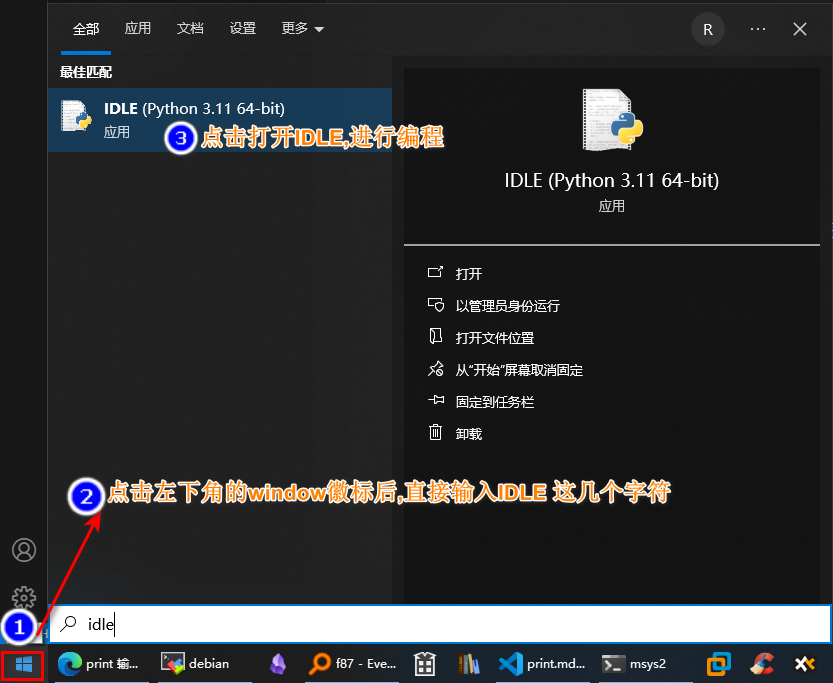

# print的使用

学习目标:

1. `print()`函数怎么使用
2. 怎么去理解函概念, 和数学上的函数概念上一样吗

## 1. 开始: 第一个代码

```python
print("hello")
```

###  1.1 执行程序
- 左下角->菜单->输入IDLE-> 打开IDLE



- 点击左上角 file -> new_file 输入内容

<video width="800" height="auto" controls>
    <source src="/video/how2run.mp4" type="video/mp4">
    您的浏览器不支持 video 标签。
</video>

print("hello")


什么是函数,这里有一个数学上的函数如下:

$$
f(x) = x +1
$$

函数可以理解成具有某个名字的**人去做一件事情**


