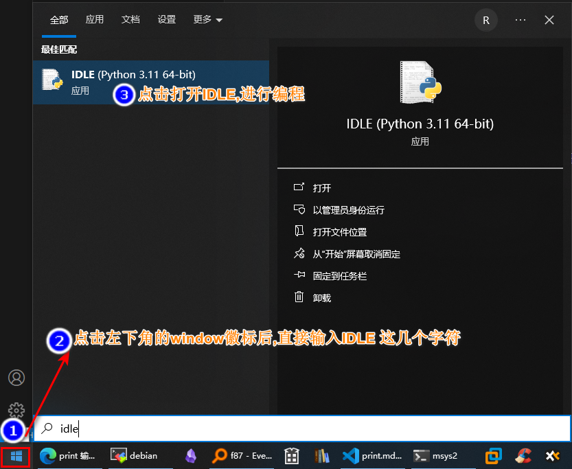

# 第一课：使用 `print()` 输出内容

## 学习目标

学完这一课，你应该能够：

1. 打开 IDLE，并新建一个 Python 文件。
2. 使用 `print()` 在屏幕上输出文字。
3. 初步理解“函数”这个概念。

## 第一个 Python 程序

请先输入下面这行代码：

```python
print("hello")
```

运行后，屏幕会显示：

```text
hello
```

这就是你的第一个 Python 程序。

## 如何运行程序

### 1. 打开 IDLE

在左下角菜单中搜索 `IDLE`，然后打开它。



### 2. 新建文件并输入代码

点击左上角 `File -> New File`，在新窗口中输入：

```python
print("hello")
```

下面的视频演示了完整过程：

<video width="800" height="auto" controls>
    <source src="/video/how2run.mp4" type="video/mp4">
    您的浏览器不支持 video 标签。
</video>

## 什么是函数

你可以先把函数理解成“有名字的一件事情”。

比如：

```python
print("hello")
```

这里的 `print` 就是函数名。它的任务是：把括号里的内容显示到屏幕上。

数学中也有函数，例如：

$$
f(x) = x + 1
$$

现在不用深入比较数学函数和 Python 函数。先记住一句话：

> 函数就是一个已经准备好的工具。你给它一些内容，它会帮你完成一件事。

## 本课小结

- `print()` 可以把内容输出到屏幕。
- 文字需要写在英文引号里，例如 `"hello"`。
- 程序中的符号要尽量使用英文符号，比如 `()` 和 `""`。


