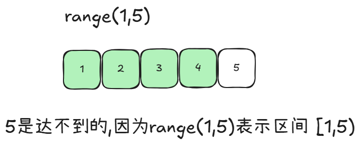
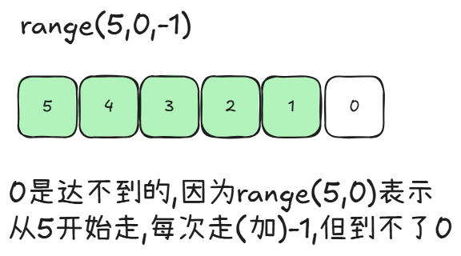

# Python 入门：告别重复劳动，拥抱 For 循环

## 1. 痛苦的笨办法

假设老师让你在屏幕上打印出 **1 到 100** 的数字。
如果你不知道循环，你可能得这样写代码：

```python
print(1)
print(2)
print(3)
print(4)
# ... (过了十分钟) ...
print(50)
# ... (手已经酸了) ...
print(99)
print(100)

```

**这太累了！**
程序员是最喜欢“偷懒”的人。如果以后要打印 1 到 10000 怎么办？写到明年吗？
为了解决这种**重复性**的工作，Python 提供了一个神器：**`for` 循环**。

## 2. 救星登场：`range()` 和 `for`

要让电脑自动帮我们数数，我们需要两个帮手：

1. **造数机器 (`range`)**：专门负责生产一串数字。
2. **搬运工 (`for`)**：专门负责把数字一个接一个拿出来。

### 第一步：理解 `range()`

`range` 在英文里是“范围”的意思。
在 Python 里，`range(1, 101)` 的意思是：“**给我生成从 1 开始，到 101 结束（但不包含 101）的整数序列**”。

> **⚠️ 注意：包头不包尾**
> * `range(1, 5)` 会生成：`1, 2, 3, 4` (没有 5)
> * 所以要打印到 100，必须写 `range(1, 101)`。
> 
> 

### 第二步：理解 `for` 循环结构

我们可以把 `for` 循环想象成一条**流水线**。

**代码公式如下：**

```python
#   (1)变量    (2)范围
for   i   in   range(1, 101):
    # (3) 要做的事情 (必须缩进)
    print(i)

```

**我们来拆解一下这句代码：**

1. **`for`**: 告诉 Python，“我要开始循环了”。
2. **`i`**: 这是一个**变量名**（你可以把它看作一个小盒子）。每次循环，它都会装入一个新的数字。
* 第一次循环，`i` 里面装的是 `1`。
* 第二次循环，`i` 里面装的是 `2`。
* 以此类推……


3. **`in`**: 意思是“从……里面拿”。
4. **`range(1, 101)`**: 这是我们的数字仓库（1 到 100）。
5. **`:` (冒号)**: 千万别忘了！它表示“下面缩进的代码归我管”。
6. **`print(i)`**: 这是具体要执行的动作。把当前 `i` 盒子里的数字打印出来。

### 3. 最终代码

把之前的 100 行代码，缩减为 2 行：

```python
for i in range(1, 101):
    print(i)

```

**计算机的内心独白是这样的：**

* “老大让我遍历 `1` 到 `100`。”
* “第一轮：把 `1` 赋值给 `i`，执行 `print(i)`，屏幕显示 1。”
* “第二轮：把 `2` 赋值给 `i`，执行 `print(i)`，屏幕显示 2。”
* ……
* “第一百轮：把 `100` 赋值给 `i`，执行 `print(i)`，屏幕显示 100。”
* “下一个是 101？哦，老板说了不包含 101，收工！”

---


## range的认识

range是python的内置函数，用于生成一个整数序列，可以用于for循环中。

## range的使用

range的使用格式如下：

```python
range(start, stop, step)
```

- start：起始值，默认为0
- stop：结束值，不包括结束值
- step：步长，默认为1





range的使用示例如下：

```python
for i in range(5):
    print(i)
```

输出结果为：

```python
0
1
2
3
4
```

## 练习题

1. 使用range生成一个1到10的整数序列，并打印出来。
    ```python
    for i in range(1,11): # 想一想 这里为什么是0->11
        print(i)
    ```
2. 使用range生成一个10到1的整数序列，并打印出来。
    ```python
    for i in range(10,0,-1): # 想一想 这里为什么end是0 
        print(i)
    ```
3. 使用range生成一个1到10的偶数序列，并打印出来。
    ```python
    for i in range(1,11): # 想一想 这里为什么是0->11
        if i % 2 == 0:
            print(i)
    ```
    ```python
    for i in range(2,11,2): # 想一想 为什么可以这样写
        print(i)
    ```
4. 使用range生成一个10到1的奇数序列，并打印出来。
    ```python
    for i in range(10,0,-1): # 想一想 这里为什么是0->11
        if i % 2 != 0:
            print(i)
    ```
    ```python
    for i in range(9,0,-2): # 想一想 为什么可以这样写
        print(i)
    ```

## 练习

### 1. 累加求和 (The Accumulator)

**题目描述：**
计算从 1 到 100 所有整数的和（即 `1 + 2 + 3 + ... + 100`），并输出最终结果。

**考察点：** 变量初始化、循环内的累加操作。

```python
# 初始化变量 total，用来装所有的和
total = 0

# 你的代码写在这里：
# 提示：range(1, 101)


print(f"1到100的和是: {total}")

```

<details>
<summary><b>点这里查看参考答案</b></summary>

```python
total = 0
for i in range(1, 101):  # 注意：要包含100，必须写到101
    total = total + i    # 或者简写为 total += i
print(f"1到100的和是: {total}")

```

</details>

---

### 2. 偶数过滤器 (The Filter)

**题目描述：**
在 1 到 20 之间，只把**偶数**（能被2整除的数）打印出来。

**考察点：** `for` 循环结合 `if` 判断，以及取余运算符 `%`。

```python
print("1-20之间的偶数有：")
for i in range(1, 21):
    # 你的代码写在这里：
    # 提示：如果 i 对 2 取余等于 0...
    pass 

```

<details>
<summary><b>点这里查看参考答案</b></summary>

```python
print("1-20之间的偶数有：")
for i in range(1, 21):
    if i % 2 == 0:  # 判断是否为偶数
        print(i, end=" ")
# 进阶写法：也可以直接用 range(2, 21, 2) 利用步长实现

```

</details>

---

### 3. 火箭倒计时 (The Countdown)

**题目描述：**
模拟火箭发射，从 10 倒数到 1，最后打印 "发射！"。

**考察点：** `range` 函数的第三个参数（步长 step），如何从大变小。

```python
print("准备倒计时...")
# 你的代码写在这里：
# 提示：range(开始, 结束, -1)


print("发射！🚀")

```

<details>
<summary><b>点这里查看参考答案</b></summary>

```python
print("准备倒计时...")
for i in range(10, 0, -1): # 从10开始，到0结束(不含0)，每次-1
    print(i)
print("发射！🚀")

```

</details>

---

### 4. 打印星星塔 (Star Triangle)

**题目描述：**
打印 5 行星星，第一行 1 个，第二行 2 个……第五行 5 个。
*效果如下：*

```text
*
**
***
****
*****

```

**考察点：** 字符串的乘法（Python 特性）或者 嵌套循环。

```python
# 方法一：利用 Python 字符串乘法 (简单)
for i in range(1, 6):
    print("*" * i) 

# 方法二：利用嵌套循环 (类似乘法表，推荐练习逻辑)
# 你的代码写在这里：


```

<details>
<summary><b>点这里查看参考答案 (嵌套循环版)</b></summary>

```python
for i in range(1, 6):      # 控制行数
    for j in range(i):     # 控制每行打印多少个
        print("*", end="") # 打印星星不换行
    print()                # 每一行打完换行

```

</details>


### 5. 选班长

班里有10个人,男生5个,用数字表示就是: `1 2 3 4 5`, 女生五个: `6 7 8 9 10`,现在各选一个男的,一个女的作为班长,输出所有的可能的方案,并输出总方案数:

```Python
total = 0
for i in range(1,6):
    for j in range(6,11):
        print(i,j)
        total = total +1
print(f"total= {total}")
```

### 6. 99乘法表格


```python
# 外层循环控制行数 i，从 1 到 9
for i in range(1, 10):
    # 内层循环控制列数 j，从 1 到 i (保证呈阶梯状)
    for j in range(1, i + 1):
        # f-string 格式化输出，end="\t" 表示用制表符隔开而不换行
        print(f"{j}*{i}={i*j}", end="\t")
    
    # 每一行结束后，打印一个空的 print 来换行
    print()
```

## 有趣的代码


```python
import turtle

# 创建一个 Turtle 对象
t = turtle.Turtle()

# 设置画笔速度 (可选，数字越大越快)
t.speed(1)

# 循环画正方形的四条边
for _ in range(4):
    t.forward(100)  # 向前移动 100 个单位
    t.right(90)    # 向右转 90 度

# 隐藏画笔 (可选，可以让图形更干净)
t.hideturtle()

# 保持窗口开启，直到手动关闭
turtle.done()
```

这个程序会在屏幕上绘制一个正方形。你可以通过修改 `t.forward(100)` 和 `t.right(90)` 中的数字来改变正方形的大小和形状。

希望这个例子能帮助你理解如何使用 `for` 循环来重复执行一段代码。如果你有任何问题或需要进一步的解释，请随时告诉我！

接下来，我们可以学习如何使用 `for` 循环来遍历其他类型的序列，比如列表和元组。你准备好了吗？😊