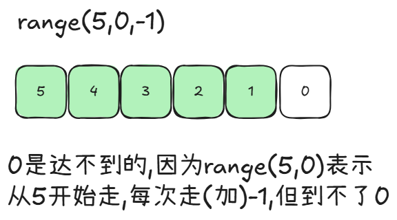

- for 循环入门
  - 什么是 for 循环？
  - for 循环的基本用法
- range的认识
- range的使用
- 练习题

# for 循环入门

欢迎来到 for 循环的世界！...

## 什么是 for 循环？

简单来说，for 循环允许你遍历一个序列（比如一个字符串或者 `range()` 函数生成的数字序列），并对序列中的每一个元素执行一次代码块。

想象一下，你有一串珠子，你想把每一颗珠子都仔细看一遍。for 循环就像你的手，它会一颗接一颗地从串上取下珠子（遍历序列），然后你对每一颗珠子都执行相同的动作（执行代码块），比如观察它的颜色和形状。

## for 循环的基本用法

for 循环的基本结构如下：

```python
for 变量 in 序列:
    # 这里是需要重复执行的代码块
    # 注意：代码块需要缩进
    print(变量)
```

- `for`：这是一个关键字，告诉 Python 我们要开始一个 for 循环。
- `变量`：这是一个你起的名字，在循环的每一次迭代中，序列中的一个元素会被赋值给这个变量。
- `in`：这是另一个关键字，用于连接变量和序列。
- `序列`：这是你想要遍历的数据集合。现在，你可以把它想象成一个字符串（比如 `"你好"`) 或者由 `range()` 函数生成的一串数字。之后我们会学习更多类型的序列。
- `:`：冒号表示循环头部的结束。
- `缩进的代码块`：这部分代码会在序列中的每个元素上执行一次。Python 对缩进非常敏感，所以确保这部分代码有正确的缩进（通常是4个空格）。

**示例：遍历一个字符串中的字符**

```python
my_name = "Python"
for character in my_name:
    print(f"字母是: {character}")
```

输出结果：

```
字母是: P
字母是: y
字母是: t
字母是: h
字母是: o
字母是: n
```

在这个例子中：
1. `my_name` 是我们的序列（一个字符串 "Python"）。
2. `character` 是我们定义的变量。
3. 循环第一次执行时，`character` 的值是 "P"，然后打印 "字母是: P"。
4. 循环第二次执行时，`character` 的值是 "y"，然后打印 "字母是: y"。
5. 这个过程会一直持续到字符串中的所有字符都被遍历一遍。
6. 字符串中的所有字符都遍历完毕，循环结束。

接下来，我们将学习一个与 for 循环经常一起使用的好帮手——`range()` 函数，它可以帮助我们生成数字序列。

## range的认识

range是python的内置函数，用于生成一个整数序列，可以用于for循环中。

## range的使用

range的使用格式如下：

```python
range(start, stop, step)
```

- start：起始值，默认为0
- stop：结束值，不包括结束值
- step：步长，默认为1




range的使用示例如下：

```python
for i in range(5):
    print(i)
```

输出结果为：

```python
0
1
2
3
4
```

## 练习题

1. 使用range生成一个1到10的整数序列，并打印出来。
    ```python
    for i in range(1,11): # 想一想 这里为什么是0->11
        print(i)
    ```
2. 使用range生成一个10到1的整数序列，并打印出来。
    ```python
    for i in range(10,0,-1): # 想一想 这里为什么end是0 
        print(i)
    ```
3. 使用range生成一个1到10的偶数序列，并打印出来。
    ```python
    for i in range(1,11): # 想一想 这里为什么是0->11
        if i % 2 == 0:
            print(i)
    ```
    ```python
    for i in range(2,11,2): # 想一想 为什么可以这样写
        print(i)
    ```
4. 使用range生成一个10到1的奇数序列，并打印出来。
    ```python
    for i in range(10,0,-1): # 想一想 这里为什么是0->11
        if i % 2 != 0:
            print(i)
    ```
    ```python
    for i in range(9,0,-2): # 想一想 为什么可以这样写
        print(i)
    ```

## 有趣的代码


```python
import turtle

# 创建一个 Turtle 对象
t = turtle.Turtle()

# 设置画笔速度 (可选，数字越大越快)
t.speed(1)

# 循环画正方形的四条边
for _ in range(4):
    t.forward(100)  # 向前移动 100 个单位
    t.right(90)    # 向右转 90 度

# 隐藏画笔 (可选，可以让图形更干净)
t.hideturtle()

# 保持窗口开启，直到手动关闭
turtle.done()
```

这个程序会在屏幕上绘制一个正方形。你可以通过修改 `t.forward(100)` 和 `t.right(90)` 中的数字来改变正方形的大小和形状。

希望这个例子能帮助你理解如何使用 `for` 循环来重复执行一段代码。如果你有任何问题或需要进一步的解释，请随时告诉我！

接下来，我们可以学习如何使用 `for` 循环来遍历其他类型的序列，比如列表和元组。你准备好了吗？😊