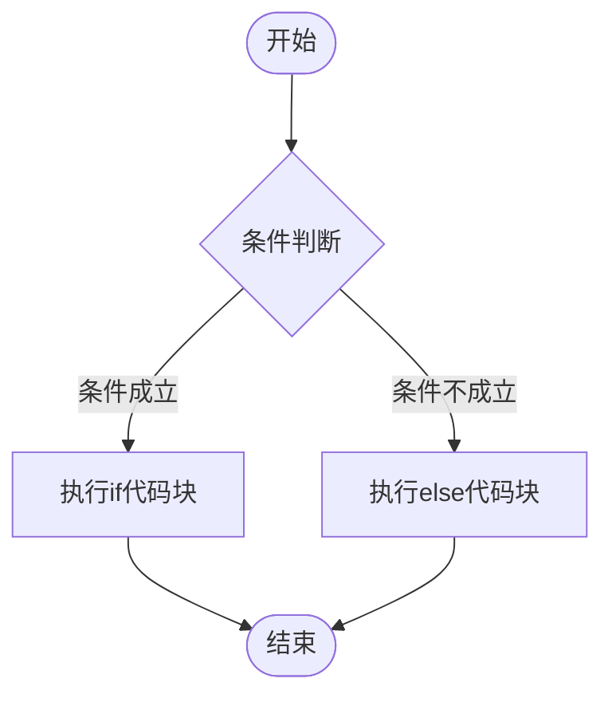

## 课程目标

1. 理解逻辑判断的概念
2. 掌握`if-elif-else`结构
3. 能够实现简单的条件分支程序


## 什么是分支结构？

想一个我们需要通过只有一个交通灯的路口。如何灯是亮的，那么就通过这个路口:输出`pass`，如何灯是不亮的，那么输出`not pass`

为了我们方便表示灯的状态，用数字`1`表示灯是亮的，数字`0`表示灯是不亮的。


那么我们可以使用python实现下面的代码：

```python
light = int(input("input 0 or 1 "))
if light == 1:
    print("pass")
else:
    print("not pass")
```


下面我们来一步一步的学习这个代码

第一句用到了前面我们学习过的内容，作用为：得到一个数字$0$或$1$，来表示灯的状态

```python
light = int(input("input 0 or 1 "))
```

第二句

```python
if light == 1:
```
我们把它分成三个部分

- `if`,这个我们直接翻译成**如果**
- `light == 1`，**注意：`==` 有两个`=`号**,在python中`==`表示相等，`=`表示赋值，一定不能搞混淆。
- `:`冒号,这里的冒号和你在写英文作文时`some boy say:` 中的冒号表示同一个意思：**冒号后面的内容表示你具体要控制（说）的内容**

整句话翻译成中文，意思就是： 如果 light与1相等。

再次强调：
python里**两个等号表示相等**，在python中一个等于号表示**赋值**，一个等于号并没有相等的这个概念。 

第三句：


```python
    print("pass")
```

1. 首先发现这句话之前，有大概4个空格的长度的空白，**这些空白是通过你键盘上的<kbd>Tab</kbd>这个键按出来的**
2. 为什么要前面要添加<kbd>Tab</kbd>呢？我们发现添加了<kbd>Tab</kbd>后，第三句`print("pass")`相对于第二句`if light == 1:`整体**靠右**.这在`python`里叫做**缩进**，**缩进**表示一种归属关系，表示哪些语句被哪句话控制。 这里第三句话相对于第二句话靠右，那么就被第二句话**控制**。


Python用缩进区分代码层级，就像书本用章节缩进表示目录结构：

```
第1章 ← 顶格
    1.1节 ← 缩进4字符
        1.1.1小节 ← 再缩进4字符
```

最后的两句话：

```python
else:
    print("not pass")
```

这个结构同样包含三个关键部分：

- `else`，直接翻译成否则
- `:`冒号，和if语句的冒号作用完全相同
- 特别注意：else没有条件表达式，它是if的自然对立面

整体翻译成： 否则，输出`not pass`

## 小练习

输入一个学生的成绩，如果达到60分以上，就输出及格(pass)，否则输出不及格(not pass)


```python
score = int(input("please input score of a student:"))
if score >= 60:
    print("pass")
else:
    print("not pass")
```


你发现了吗，这里我们用`>=`来表示**大于等于**这个概念。

同样的还有：

| 符号名称        | 符号表示       | 示例                | 说明                                   |
|----------------|---------------|---------------------|----------------------------------------|
| **等于**        | `==`          | `age ==18`          | 值相等判断（区分大小写）                |
| **不等于**      | `!=`          | `name != "admin"`   | 值不相等判断                            |
| **大于**        | `>`           | `score > 90`        | 数值比较                                |
| **小于**        | `<`           | `temperature < 0`   | 数值比较                                |
| **大于等于**    | `>=`          | `count >= 10`       | 包含等于的大于判断                      |
| **小于等于**    | `<=`          | `age <= 12`         | 包含等于的小于判断                      |


## 总结

