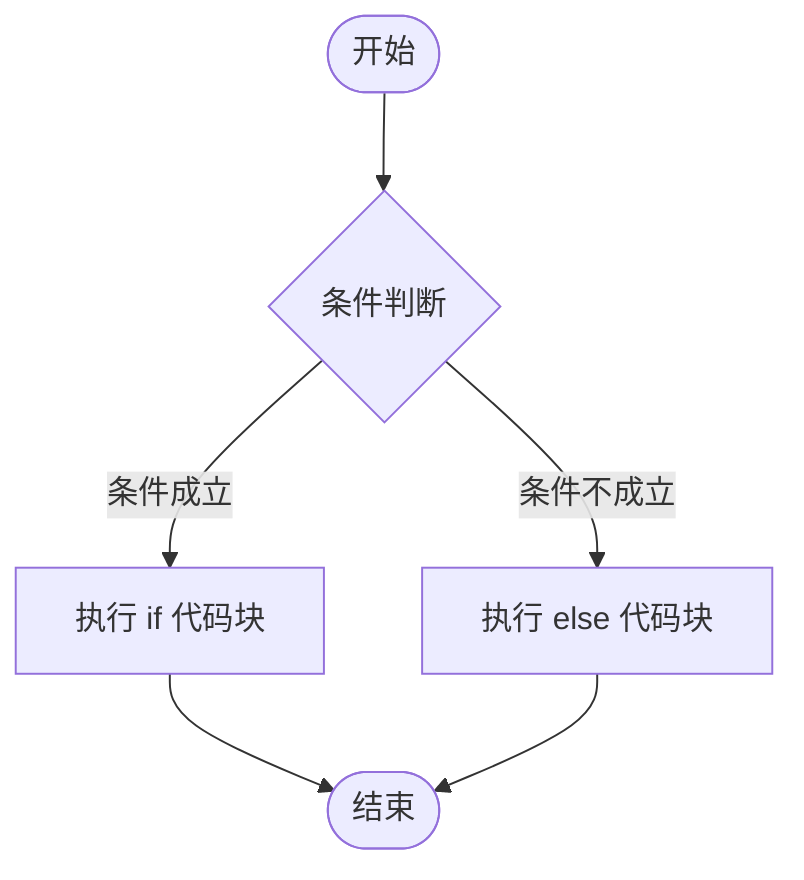

# `if-else` 双分支

## 学习目标

学完这一课，你应该能够：

1. 理解什么是条件判断。
2. 掌握 `if-else` 的基本结构。
3. 区分 `=` 和 `==`。
4. 知道缩进在 Python 中的作用。

## 什么是分支结构

程序有时候需要根据不同情况做不同的事情。

例如过马路：

- 如果交通灯亮了，就通过路口，输出 `pass`。
- 否则，不通过路口，输出 `not pass`。

为了方便表示灯的状态，我们用数字表示：

- `1` 表示灯亮。
- `0` 表示灯不亮。


对应的 Python 代码是：

```python
light = int(input("input 0 or 1: "))

if light == 1:
    print("pass")
else:
    print("not pass")
```

## 代码一步一步看

### 1. 输入灯的状态

```python
light = int(input("input 0 or 1: "))
```

这行代码会让用户输入 `0` 或 `1`，再用 `int()` 转换成整数，最后保存到变量 `light` 中。

### 2. 判断条件

```python
if light == 1:
```

这一行可以分成三部分：

- `if`：如果。
- `light == 1`：判断 `light` 是否等于 `1`。
- `:`：冒号，表示下面缩进的代码归这个 `if` 管。

!!! note
    `==` 表示“判断是否相等”。
    `=` 表示“赋值”。
    这两个符号一定不能混用。

### 3. 缩进表示归属关系

```python
    print("pass")
```

这一行前面有缩进。缩进表示这行代码属于上面的 `if`。

也就是说，只有当 `light == 1` 成立时，才会执行：

```python
print("pass")
```

Python 用缩进表示代码层级。你可以把它想象成目录：

```text
第1章
    1.1节
        1.1.1小节
```

### 4. `else` 表示否则

```python
else:
    print("not pass")
```

`else` 的意思是“否则”。

当 `if` 的条件不成立时，就会执行 `else` 下面的代码。

## 小练习：判断是否及格

输入一个学生成绩。如果成绩大于等于 `60`，输出 `pass`；否则输出 `not pass`。

```python
score = int(input("please input score of a student: "))

if score >= 60:
    print("pass")
else:
    print("not pass")
```

这里的 `>=` 表示“大于等于”。

## 常用比较符号

| 符号名称 | 符号 | 示例 | 说明 |
|---------|------|------|------|
| 等于 | `==` | `age == 18` | 判断两个值是否相等 |
| 不等于 | `!=` | `name != "admin"` | 判断两个值是否不相等 |
| 大于 | `>` | `score > 90` | 判断左边是否大于右边 |
| 小于 | `<` | `temperature < 0` | 判断左边是否小于右边 |
| 大于等于 | `>=` | `count >= 10` | 包含等于 |
| 小于等于 | `<=` | `age <= 12` | 包含等于 |

## 流程图


```mermaid
graph TD
    Start([开始]) --> Condition{条件判断}
    Condition -- 条件成立 --> Action1[执行 if 代码块]
    Action1 --> End([结束])
    Condition -- 条件不成立 --> Action2[执行 else 代码块]
    Action2 --> End
```

## 本课小结

- `if` 表示“如果”。
- `else` 表示“否则”。
- `if-else` 适合处理二选一的问题。
- Python 用缩进表示哪些代码属于 `if` 或 `else`。
