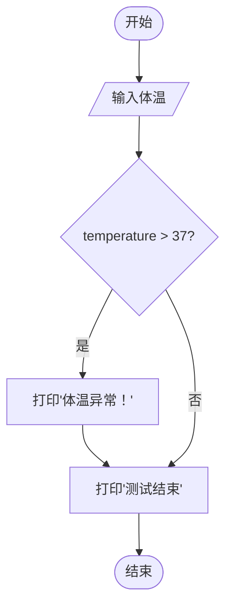

## 常用逻辑符号

这里是下节课我们学习过的内容，这里我们再学习一下。

| 符号名称        | 符号表示       | 示例                | 说明                                   |
|----------------|---------------|---------------------|----------------------------------------|
| **逻辑与**      | `and`         | `x >5 and y <3`     | 两个条件都满足时返回True                |
| **逻辑或**      | `or`          | `x ==0 or y ==0`    | 任意一个条件满足时返回True              |
| **逻辑非**      | `not`         | `not is_empty`      | 对布尔值取反（True变False，反之亦然）   |
| **等于**        | `==`          | `age ==18`          | 值相等判断（区分大小写）                |
| **不等于**      | `!=`          | `name != "admin"`   | 值不相等判断                            |
| **大于**        | `>`           | `score > 90`        | 数值比较                                |
| **小于**        | `<`           | `temperature < 0`   | 数值比较                                |
| **大于等于**    | `>=`          | `count >= 10`       | 包含等于的大于判断                      |
| **小于等于**    | `<=`          | `age <= 12`         | 包含等于的小于判断                      |

## 单分支


## 课程目标

1. 理解单条件逻辑判断的概念
2. 掌握`if`单分支结构
3. 能够实现简单的单条件判断程序

## 什么是单分支结构？

假设我们需要检测体温是否正常。如果体温超过37度，就输出`体温异常！`，否则不做任何提示。

为了方便表示体温状态，我们用浮点数表示具体温度值（单位：℃）


对应的Python代码实现：

```python
temperature = int(input("请输入体温："))
if temperature > 37:
    print("体温异常！")
print("测试结束")
```

## 代码流程




## 代码解析

第一句获取用户输入的体温值：

```python
temperature = intput(input("请输入体温："))
```


常见错误警示

1. ❌ 忘记冒号：
```python
if temperature > 37.3  # 缺少冒号
    print("体温异常！")
```

2. ❌ 错误使用赋值运算符：
```
if temperature = 37.3:  # 应该用==而不是=
    print("体温异常！")
```

3. ❌ 缩进不一致：
```python
if temperature > 37.3:
print("体温异常！")  # 缺少缩进
```


小练习
编写程序实现：输入考试成绩，如果达到90分以上，输出"优秀"

示例代码：

```pyton
score = int(input("请输入考试成绩："))
if score > 90:
    print("优秀")
```

## 更多练习


## 1. 两数乘积
给定两个整数，编写一个 Python 代码，仅当乘积等于或小于 1000 时才返回其乘积。否则，返回其总和。

### 数据1
```
20
30
```

```
600
```

### 数据2
```
40
30
```

```
70
```

```python
a = int(input())
b = int(input())
c = a*b
# check if product is less then 1000
if c <= 1000:
    print(c)
else:
    # product is greater than 1000 calculate sum
    print(a+b)
```
## 2. 三角形判断

### 【题目描述】

给定三个正整数，分别表示三条线段的长度，判断这三条线段能否构成一个三角形。如果能构成三角形，则输出 “yes”，否则输出 “no”。

### 【输入】
输入共一行，包含三个正整数，分别表示三条线段的长度，数与数之间以一个空格分开。

### 【输出】

如果能构成三角形，则输出 “yes” ，否则输出 “no”。

### 【输入样例】

```
3
4
5
```

### 【输出样例】

```
yes
```

```python
a = int(input())
b = int(input())
c = int(input())

# 让x变成最大的边的长度
x = a 
if x < b:
    x = b
if x < c:
    x = c

# y 是较小的两个边的和
y = a+b+c - x 

# 两个较小边之和 小于等于 第三条边 就不能组成三角形
if y <= x:
    print("no")
else:
    print("yes")
```

## 3. 判断一个数能否同时被 3 和 5 整除 

### 【题目描述】
判断一个数 n 能否同时被 3 和 5 整除，如果能同时被 3 和 5 整除输出 YES，否则输出 NO。

### 【输入】
输入一行，包含一个整数 n。（ -1,000,000 < n < 1,000,000）

### 【输出】
输出一行，如果能同时被 3 和 5 整除输出 YES，否则输出 NO。

### 【输入样例】

```
15
```

### 【输出样例】

```
YES
```

```python
a = int(input())
# 数学小知识: 
# 一个数字x能同时被3 和 5 整除 等价于 x能被15整除
# 这两个命题是充分必要的
if a % 15 == 0:
    print("YES")
else:
    print("NO")
```

### 4. 输出绝对值

### 【题目描述】

输入一个浮点数，输出这个浮点数的绝对值，保留到小数点后两位。

### 【输入】
输入一个浮点数，其绝对值不超过 10000。

### 【输出】
输出这个浮点数的绝对值，保留到小数点后两位。

### 【输入样例】

```
-3
```

### 【输出样例】

```
3
```

### 方法一：

```python
a = int(input())
if a < 0 :
    a = -a
print(a)
```

### 方法二：

```python
a = int(input())
if a < 0 :
    print(-a)
else:
    print(a)
```

显然方法一的字数比方法二的少，但是实现的效果一样。


## 5. 水仙花数问题

## 【题目描述】
判断一个数字是否为“水仙花数”，所谓的“水仙花数”是指一个三位数其各位数字的立方和等于该数本身，例如153是“水仙花数”，因为：$153 = 1^3 + 5^3 + 3^3$。

### 【输入】
一行，包含一个三位数。

### 【输出】

一行，如果是“水仙花数”，则输出 “yes” ，否则输出 “no”。

### 【输入样例】

```
153
```
### 【输出样例】

```
yes
```

```python
a=int(input("请输入数字"))
s1=a%10
s2=(a//10)%10
s3=a//100
if a==s1**3+s2**3+s3**3:
    print("yes")
else:
    print("no")
```

