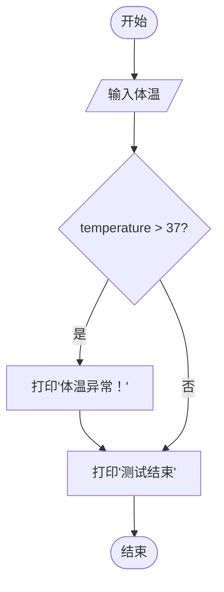

# `if` 单分支

## 学习目标

学完这一课，你应该能够：

1. 理解单分支结构。
2. 掌握只有 `if`、没有 `else` 的写法。
3. 能用 `if` 处理“满足条件才做某事”的问题。

## 常用符号回顾

| 符号名称 | 符号 | 示例 | 说明 |
|---------|------|------|------|
| 逻辑与 | `and` | `x > 5 and y < 3` | 两个条件都满足 |
| 逻辑或 | `or` | `x == 0 or y == 0` | 任意一个条件满足 |
| 逻辑非 | `not` | `not is_empty` | 对真假取反 |
| 等于 | `==` | `age == 18` | 判断是否相等 |
| 不等于 | `!=` | `name != "admin"` | 判断是否不相等 |
| 大于 | `>` | `score > 90` | 数值比较 |
| 小于 | `<` | `temperature < 0` | 数值比较 |
| 大于等于 | `>=` | `count >= 10` | 包含等于 |
| 小于等于 | `<=` | `age <= 12` | 包含等于 |

## 什么是单分支结构

有些问题不是“二选一”，而是“满足条件才做一件事，不满足就跳过”。

例如检测体温：

- 如果体温超过 `37` 度，输出 `体温异常！`。
- 如果体温不超过 `37` 度，就不输出异常提示。
- 最后都输出 `测试结束`。

```python
temperature = float(input("请输入体温："))

if temperature > 37:
    print("体温异常！")

print("测试结束")
```

## 代码流程


```mermaid
flowchart TD
    A([开始]) --> B[/"输入体温"/]
    B --> C{"temperature > 37?"}
    C -->|是| D["打印'体温异常！'"]
    D --> E["打印'测试结束'"]
    C -->|否| E
    E --> F([结束])
```

## 代码解析

输入体温：

```python
temperature = float(input("请输入体温："))
```

判断是否超过 `37` 度：

```python
if temperature > 37:
    print("体温异常！")
```

最后输出测试结束：

```python
print("测试结束")
```

注意：最后一行没有缩进，所以它不属于 `if`。无论条件是否成立，它都会执行。

## 常见错误

### 1. 忘记冒号

```python
if temperature > 37.3
    print("体温异常！")
```

正确写法：

```python
if temperature > 37.3:
    print("体温异常！")
```

### 2. 把 `==` 写成 `=`

```python
if temperature = 37.3:
    print("体温异常！")
```

如果要判断相等，应该写：

```python
if temperature == 37.3:
    print("体温异常！")
```

### 3. 忘记缩进

```python
if temperature > 37.3:
print("体温异常！")
```

正确写法：

```python
if temperature > 37.3:
    print("体温异常！")
```

## 小练习：优秀成绩

输入考试成绩。如果成绩达到 `90` 分或以上，输出 `优秀`。

```python
score = int(input("请输入考试成绩："))

if score >= 90:
    print("优秀")
```

## 更多练习

### 1. 两数乘积

输入两个整数。如果它们的乘积小于等于 `1000`，输出乘积；否则输出两个数的和。

输入示例 1：

```text
20
30
```

输出示例 1：

```text
600
```

输入示例 2：

```text
40
30
```

输出示例 2：

```text
70
```

参考代码：

```python
a = int(input())
b = int(input())

c = a * b

if c <= 1000:
    print(c)
else:
    print(a + b)
```

### 2. 三角形判断

输入三条线段的长度，判断它们能否组成三角形。能组成就输出 `yes`，否则输出 `no`。

判断方法：较短的两条边之和必须大于最长边。

输入示例：

```text
3
4
5
```

输出示例：

```text
yes
```

参考代码：

```python
a = int(input())
b = int(input())
c = int(input())

x = a
if x < b:
    x = b
if x < c:
    x = c

y = a + b + c - x

if y <= x:
    print("no")
else:
    print("yes")
```

### 3. 同时被 3 和 5 整除

输入一个整数，判断它能否同时被 `3` 和 `5` 整除。能就输出 `YES`，否则输出 `NO`。

```python
a = int(input())

if a % 15 == 0:
    print("YES")
else:
    print("NO")
```

### 4. 输出绝对值

输入一个整数，输出它的绝对值。

输入示例：

```text
-3
```

输出示例：

```text
3
```

方法一：

```python
a = int(input())

if a < 0:
    a = -a

print(a)
```

方法二：

```python
a = int(input())

if a < 0:
    print(-a)
else:
    print(a)
```

方法一先修改变量，再统一输出，代码更短。

### 5. 水仙花数

输入一个三位数，判断它是否是水仙花数。

水仙花数指：一个三位数各位数字的立方和等于它本身。

例如：

$$
153 = 1^3 + 5^3 + 3^3
$$

参考代码：

```python
a = int(input("请输入数字："))

if a < 100 or a > 999:
    print("no")
else:
    s1 = a % 10
    s2 = a // 10 % 10
    s3 = a // 100

    if s1 * s1 * s1 + s2 * s2 * s2 + s3 * s3 * s3 == a:
        print("yes")
    else:
        print("no")
```

## 本课小结

- 单分支只有 `if`，没有 `else`。
- 单分支适合“满足条件才做某事”的情况。
- 没有缩进的代码不属于 `if`，会继续正常执行。
