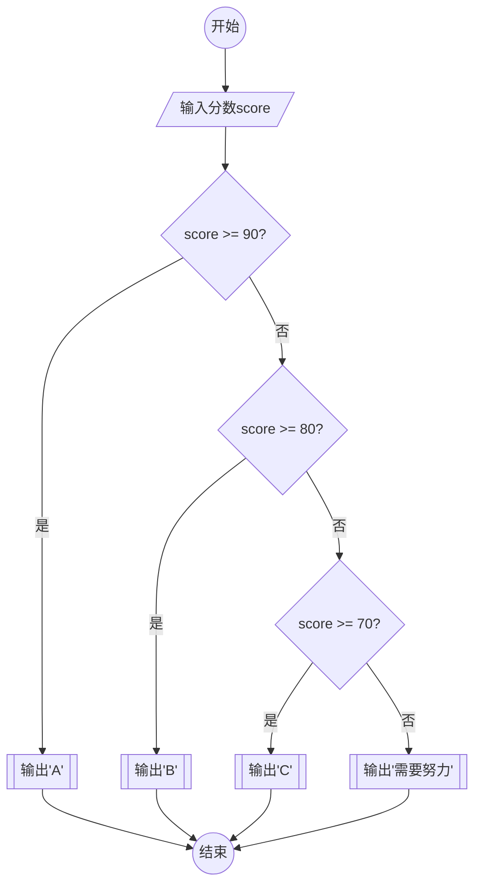

# 多分支

## 课程目标

学习新的关键字`elif` 它是由`else if`这两个单词合起来的缩写.

翻译成:`否则 如果`

1. 理解多条件判断的应用场景
2. 掌握`if-elif-else`的层级关系
3. 能够处理三选一以上的条件分支

## 多条件决策结构

想象一个成绩评级系统：

- 90分以上显示"A"
- 80-89分显示"B"
- 70-79分显示"C"
- 其他情况显示"需要努力"

```python
score = int(input("输入分数 0-100 "))
if score >= 90:
    print("A")
elif score >= 80: # 注意如果score >= 80 成立, 只会输出B 
    print("B")
elif score >= 70:
    print("C")
else:
    print("需要努力")
```


对应的流程图



##  代码解析

输入处理

```python
score = int(input("输入分数（0-100）"))
```

条件判断结构

```python
if score >= 90:
    print("A")
elif score >= 80:
    print("B")
elif score >= 70:
    print("C")
else:
    print("需要努力")
```

关键细节: 执行顺序

1. 检查if条件 → True则执行对应代码块
2. 若if不成立 → 检查第一个elif条件
3. 重复步骤2直到找到匹配条件
4. 所有条件都不满足时执行else

## 小练习 知识迁移

尝试编写温度提示程序：

- 35度以上：建议防暑
- 20-35度：适宜外出
- 0-19度：注意保暖
- 零下：小心结冰

```python
temperature = int(input("当前温度："))
if temperature > 35:
    print("高温预警！")
elif temperature >= 20:
    print("户外活动好时机")
elif temperature >= 0:
    print("建议添加外套")
else:
    print("道路可能结冰")
```


## 练习

## 1. 收集瓶盖赢大奖

### 【题目描述】

某饮料公司最近推出了一个 “收集瓶盖赢大奖” 的活动：如果你拥有 10 个印有 “幸运”、或 20 个印有 “鼓励” 的瓶盖，就可以兑换一个神秘大奖。现分别给出你拥有的印有 “幸运” 和 “鼓励” 的瓶盖数，判断是否可以去兑换大奖。若可以兑换大奖，输出 1，否则输出 0。

### 【输入】
一行，包含两个整数，分别是印有 “幸运” 和 “鼓励” 的瓶盖数，用一个空格隔开。

### 【输出】
一行。若可以兑换大奖，输出 1，否则输出 0。

### 【输入样例】
```
11
19
```
#### 【输出样例】
```
1
```

```python
a = int(input())
b = int(input())
if a>=10 or b >=20:
    print(1)
else:
    print(0)
```


## 2. 骑车与走路

在校园里，没有自行车，上课办事会很不方便。但实际上。并非去办任何事情都是骑车快，因为骑车总要找车、开锁、停车、锁车等，这要耽误一些时间。假设找到自行车，开锁并车上自行车的时间为 27 秒；停车锁车的时间为 23 秒；步行每秒行走 1.2 米，骑车每秒行走 3.0 米。请判断走不同的距离去办事，是骑车快还是走路快。如果骑车快，输出一行 "Bike"；如果走路快，输出一行 "Walk"；如果一样快，输出一行 "All"。


### 【输入】

输入一行，包含一个整数，表示一次办事要行走的距离，单位为米。

### 【输出】

输出一行，如果骑车快，输出一行 "Bike"; 如果走路快，输出一行 "Walk"; 如果一样快，输出一行 "All"。


### 样例

```
100
```

```
Bike
```

### 代码

```python
m = int(input())
bike_time = 27+23 + m / 3
walk_time = m / 1.2

if bike_time < walk_time:
    print("Bike")
elif walk_time < bike time:
    print("Walk")
else:
    print("All")
```