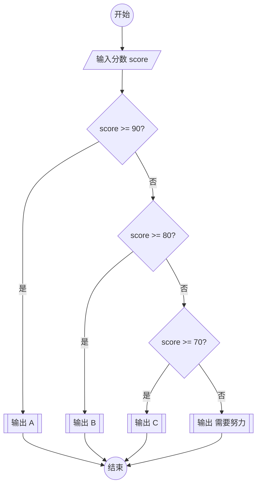

# `if-elif-else` 多分支

## 学习目标

学完这一课，你应该能够：

1. 理解多分支判断的使用场景。
2. 掌握 `if-elif-else` 的执行顺序。
3. 处理三种或三种以上的情况。

## 什么是 `elif`

`elif` 是 `else if` 的缩写，可以理解成“否则，如果……”。

当一个问题不只是二选一，而是多选一时，就可以使用 `elif`。

例如成绩评级：

- `90` 分及以上：输出 `A`
- `80` 到 `89` 分：输出 `B`
- `70` 到 `79` 分：输出 `C`
- 其他情况：输出 `需要努力`

```python
score = int(input("输入分数 0-100: "))

if score >= 90:
    print("A")
elif score >= 80:
    print("B")
elif score >= 70:
    print("C")
else:
    print("需要努力")
```

## 执行顺序

Python 会从上往下检查条件：

1. 先看 `if` 条件。
2. 如果不成立，再看第一个 `elif`。
3. 如果还不成立，继续看下一个 `elif`。
4. 如果所有条件都不成立，执行 `else`。

只要有一个条件成立，后面的分支就不会再检查。

例如 `score = 85`：

- `score >= 90` 不成立。
- `score >= 80` 成立，输出 `B`。
- 后面的 `score >= 70` 不会再检查。

## 流程图


```mermaid
flowchart TD
    Start(("开始")) --> Input[/"输入分数 score"/]
    Input --> ConditionA{"score >= 90?"}
    ConditionA -->|是| OutputA[["输出 A"]]
    ConditionA -->|否| ConditionB{"score >= 80?"}
    ConditionB -->|是| OutputB[["输出 B"]]
    ConditionB -->|否| ConditionC{"score >= 70?"}
    ConditionC -->|是| OutputC[["输出 C"]]
    ConditionC -->|否| OutputD[["输出 需要努力"]]
    OutputA --> End(("结束"))
    OutputB --> End
    OutputC --> End
    OutputD --> End
```

## 小练习：温度提示

请根据温度输出提示：

- 高于 `35` 度：输出 `高温预警！`
- `20` 到 `35` 度：输出 `户外活动好时机`
- `0` 到 `19` 度：输出 `建议添加外套`
- 低于 `0` 度：输出 `道路可能结冰`

```python
temperature = int(input("当前温度："))

if temperature > 35:
    print("高温预警！")
elif temperature >= 20:
    print("户外活动好时机")
elif temperature >= 0:
    print("建议添加外套")
else:
    print("道路可能结冰")
```

## 练习

### 1. 收集瓶盖赢大奖

某饮料公司推出活动：如果你有 `10` 个印有“幸运”的瓶盖，或者有 `20` 个印有“鼓励”的瓶盖，就可以兑换大奖。

输入你拥有的两种瓶盖数量。如果可以兑换，输出 `1`；否则输出 `0`。

输入示例：

```text
11
19
```

输出示例：

```text
1
```

参考代码：

```python
a = int(input())
b = int(input())

if a >= 10 or b >= 20:
    print(1)
else:
    print(0)
```

### 2. 骑车与走路

去办事时，骑车不一定总是更快。因为骑车还需要找车、开锁、停车、锁车。

已知：

- 找车、开锁、上车共用 `27` 秒。
- 停车、锁车共用 `23` 秒。
- 步行速度是每秒 `1.2` 米。
- 骑车速度是每秒 `3.0` 米。

输入距离，判断哪种方式更快：

- 骑车快，输出 `Bike`。
- 走路快，输出 `Walk`。
- 一样快，输出 `All`。

输入示例：

```text
100
```

输出示例：

```text
Bike
```

参考代码：

```python
m = int(input())

bike_time = 27 + 23 + m / 3
walk_time = m / 1.2

if bike_time < walk_time:
    print("Bike")
elif walk_time < bike_time:
    print("Walk")
else:
    print("All")
```

## 本课小结

- `elif` 表示“否则，如果……”。
- `if-elif-else` 适合多选一的问题。
- 多分支会从上到下检查，找到第一个成立的条件后就停止。
