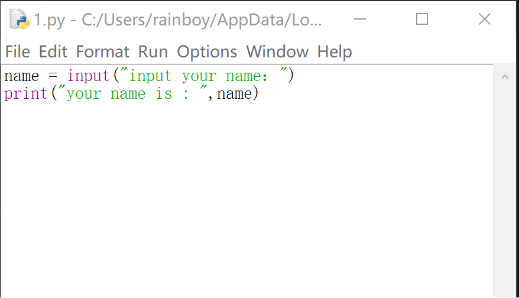
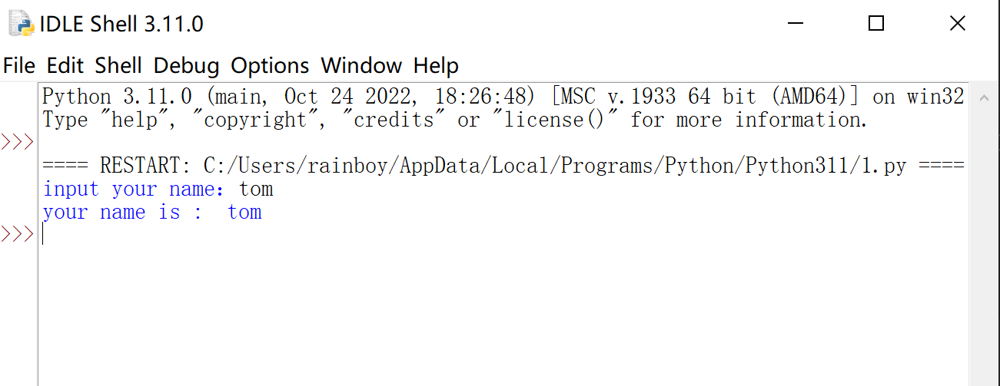

##  Python input函数使用指南

📝 `input()` 是Python中最基础的输入函数，帮助程序与用户进行交互。本教程将带您掌握以下内容：

1. → 基础语法与返回值
2. → 类型转换技巧
3. → 实用案例演示
4. → 常见问题解析


## 一、基础用法

```python
# 基本语法结构
变量名 = input("提示信息")
```

- 显示提示信息（可选）
- 等待用户输入
- 用户按回车确认输入
- 返回字符串类型数据

## 二，小例子

```python
name = input("input your name：")
print("your name is : ",name)
```

在IDLE里输入代码，根据提示输入名字: Tom.






## 三，input 得到的数据的类型

上面的代码中变量`name`中存的数据由`input`通过键盘得到,那么数据类型是什么呢。我们到这里只学过两种数据类型： `Number`, `String` .这里的`name`的类型是字符串，因为`tom`不可能是数字.所以上面的代码相当于

```python
print("tom")
```

思维迁移。所以下面的的代码如果输入数字`123`，那也会输出`123`，这里输出的内容也是：`123`

```python
a = input("input some number:")
print("a is :",a)
```

问：这里的变量`a`里面存的数据类型是`Number`还是`String`?


答：是字符串`String`

证明如下

```python
a = input("input some number:")
print("a+1 is :",a+1)
```

上面的代码会运行报错，因为数字不能与`String`相加!

## 四，得到数字 

这里我们使用`int()`，它的作用是把只含有数字模式的字符串转化成对的数字

```python
a = int("123")
print("a+1 is :",a+1)
```

结合上面所学：


```python
a = int(input("input some number:"))
print("a+1 is :",a+1)
```

## 五，练习1: 简易加法器

输入两个数字，计算它们的和

```python
a = int(input("input first number："))
b = int(input("input second number："))
print(a,"+",b,"=",a+b)
```


## 六，练习2: 分钟小时转换

输入一个数字，转换成多少个小时多少分钟

这里我们需要学习一个新的计算符号,

- `%`，`c = 8 % 6`,这里c是2，得到是**余数**
- `//`，`c = 8 // 6`,这里c是1，得到的是**商**

```python
# 获取用户输入的分钟数，并将其转换为整数类型
total_minutes = int(input("input minutes："))

# 计算完整的小时数：将总分钟数除以 60，取整数部分
hours = total_minutes // 60

# 计算剩余的分钟数：将总分钟数对 60 取余
minutes = total_minutes % 60

# 输出结果，格式为 "小时 分钟"
print(hours, minutes)
```