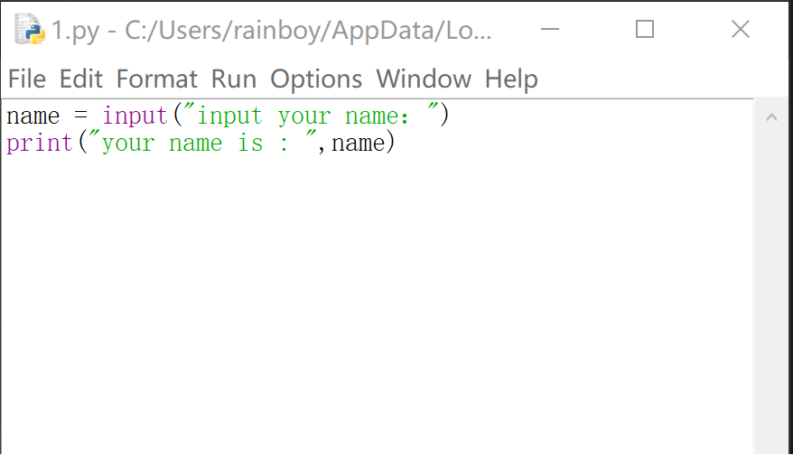
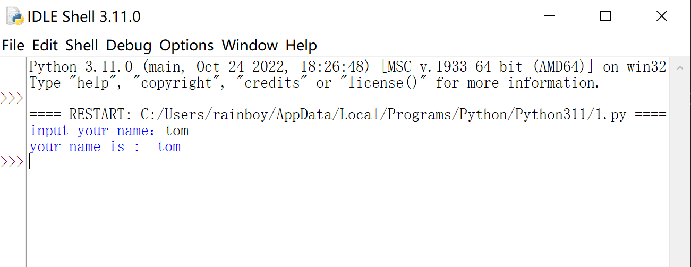

# `input()` 输入函数

## 学习目标

学完这一课，你应该能够：

1. 使用 `input()` 接收键盘输入。
2. 知道 `input()` 得到的内容是字符串。
3. 使用 `int()` 把输入内容转换成整数。
4. 编写简单的输入计算程序。

## `input()` 的基本用法

`input()` 可以让程序暂停下来，等待用户从键盘输入内容。

基本格式：

```python
变量名 = input("提示信息")
```

执行过程是：

1. 屏幕显示提示信息。
2. 用户输入内容。
3. 用户按回车。
4. Python 把输入内容保存到变量里。

## 第一个例子

```python
name = input("input your name: ")
print("your name is:", name)
```

在 IDLE 中运行后，根据提示输入名字，例如 `Tom`。





## `input()` 得到的是什么类型

请看这个程序：

```python
a = input("input some number: ")
print("a is:", a)
```

如果你输入 `123`，屏幕会输出：

```text
a is: 123
```

但是这里的 `a` 不是数字，而是字符串。

也就是说，输入的 `123` 相当于：

```python
a = "123"
```

为什么要特别注意这一点？因为字符串不能直接和数字相加。

```python
a = input("input some number: ")
print("a + 1 is:", a + 1)
```

这段代码会报错，因为 `a` 是字符串，`1` 是整数。

## 输入数字时使用 `int()`

如果你希望输入的内容作为数字使用，需要用 `int()` 转换。

```python
a = int(input("input some number: "))
print("a + 1 is:", a + 1)
```

如果输入 `123`，输出就是：

```text
a + 1 is: 124
```

可以把这行代码拆开理解：

```python
text = input("input some number: ")
a = int(text)
print(a + 1)
```

第一步先得到字符串，第二步再转换成整数。

## 练习 1：简易加法器

输入两个整数，计算它们的和。

```python
a = int(input("input first number: "))
b = int(input("input second number: "))
print(a, "+", b, "=", a + b)
```

## 练习 2：分钟转换

输入一个分钟数，转换成“多少小时多少分钟”。

这里会用到两个运算符：

- `%`：取余数。例如 `8 % 6` 的结果是 `2`。
- `//`：整除。例如 `8 // 6` 的结果是 `1`。

```python
total_minutes = int(input("input minutes: "))

hours = total_minutes // 60
minutes = total_minutes % 60

print(hours, minutes)
```

如果输入 `125`，输出：

```text
2 5
```

意思是 `125` 分钟等于 `2` 小时 `5` 分钟。

## 本课小结

- `input()` 用来接收键盘输入。
- `input()` 得到的内容默认是字符串。
- 要把输入当作整数计算，需要写 `int(input(...))`。
- 输入计算题常见步骤是：输入、转换、计算、输出。
