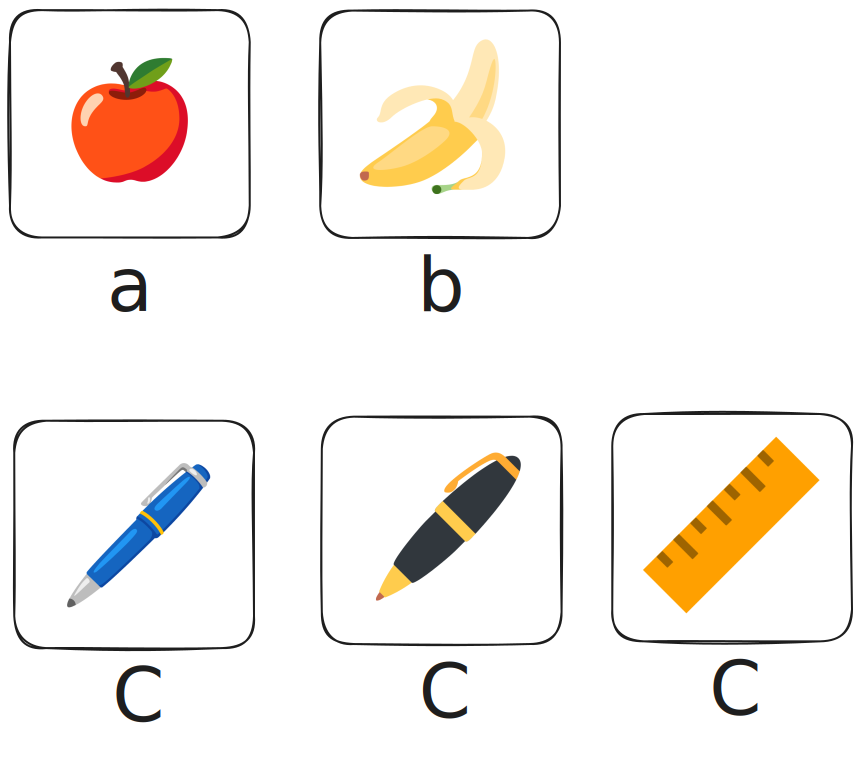
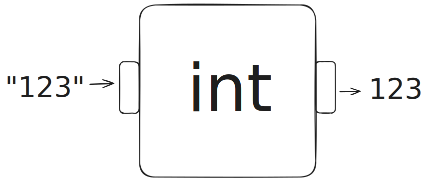

## 变量类型

在[上一节](./variable.md)我们学会了变量，它就像一个贴着名字的箱子，可以用来存放东西。

现在，让我们想得更具体一点。在生活中，我们我们可以把各种东西放到箱子里,但是呢我们通常会把放到箱子里的东西进行一下简单的分类: 比如说水果(香蕉,苹果,梨),文具(铅笔1,铅笔2, 铅笔3)



在 Python 的世界里也是一样！我们放进变量“箱子”里的数据，也需要分门别类。这样做能帮助 Python 理解我们想让它干什么。最常见的数据类型有这几种：

- **整数 (int)**: 就是没有小数点的数字，比如 `7`, `-25`, `100`。你可以用它来计数，比如“我有 **3** 个苹果”。
- **浮点数 (float)**: 就是带小数点的数字，比如 `3.14`, `-0.5`, `99.9`。你可以用它来表示需要精确数值的场景，比如“一瓶可乐 **2.5** 元”。
- **字符串 (str)**: 就是文字，需要用引号 `""` 或 `''` 括起来，比如 `"你好, Python!"`, `'Tom'`。你可以用它来存储名字、句子等任何文本信息。

了解数据类型非常重要，因为它决定了我们能对这些数据做什么样的操作。比如，数字可以做加减乘除，但文字就不行。


```python
a = 1 # 变量 a 被赋值为一个整数 (int)
a = 1.1 # 现在，a 的值被更新为一个浮点数 (float)
a = 1.0 # a 再次被更新，1.0 也是一个浮点数 (float)
a = "hello world" # 现在，a 的值被更新为一个字符串 (str)
a = "my name is tom" # a 再次被更新，值为另一个字符串 (str)
```


!!! note
    总结: 就像现实生活中一样,在 Python 中,我们也需要把放到箱子里的数据进行一下简单的分类

### "123" 与 123：文字还是数字？

这是一个非常好的问题！我们来看一段代码：
```python
print("123")
print(123)
```
运行后，屏幕上会出现两行 `123`，看起来一模一样。但它们在 Python 眼里，是完全不同的两种东西。

那么，`"123"` 与 `123` 的根本区别是什么呢？让我们做一个小实验：
```python
# 实验一：数字的加法
print(123 + 1)

# 实验二：字符串的“加法”
print("123" + "1")

# 实验三：字符串和数字相加（前方高能！）
print("123" + 1)
```

把上面的代码输入到 IDLE 中运行，你会发现：

1.  **实验一**会输出 `124`。这是我们熟悉的数学加法。
2.  **实验二**会输出 `1231`。对于字符串，`+` 号不是做加法，而是**拼接**，就是把两个字符串首尾相连。
3.  **实验三**会直接报错！Python 会告诉你 `TypeError: can only concatenate str (not "int") to str`，意思是“只能将字符串和字符串拼接，不能把整数拼接到字符串上”。

**结论：**

-   `123` 是一个**整数 (int)**，是真正的数字，可以进行数学运算（加减乘除等）。
-   `"123"` 是一个**字符串 (str)**，本质是文本，即使内容看起来像数字。对它进行 `+` 操作是拼接，而不是计算。

这个区别至关重要，因为它直接关系到我们如何处理从 `input()` 函数得到的数据。记住，`input()` 接收的所有内容，默认都是**字符串**！

## `int()`函数


如果我有一个字符串`"123"` 这个时候我想要把它`+1` 然后输出到屏幕上`124`,我应该如何做呢🤔？

显然

```python
print("123" +1)
```

这样是错的!

那么这里呢，我就来借用一个神奇的魔法: `int()`函数




我们想象出有一个箱子,叫作`int`,我们并不知道箱子的内部是什么样子的.但是我们发现这个箱子呢有两个管道，一个管道是进入的，一个管道是出来的. 当我们从进入的管道里放入一个东西`"123"`,那么出来的管道就会给我们一个这个字符串所对应的数字:`123`.好的，你已经学会了`int()`的使用

下面我们来看一些代码

```python
a = "101"
b = int(a)
print(b)
```

```python
a = "543"
print(int(a) + int(a))
```

```python
a = "543"
b = "213"
c = a+b
d = int(c) + int(b)
print(d)
```


## 练习题目

现在，让我们通过几个小练习来检验一下学习成果吧！

### 练习1：火眼金睛辨类型

请判断下面的变量分别是哪种数据类型（`int`, `float`, `str`）？

```python
a = 5
b = "hello"
c = 9.8
d = "25"
```

### 练习2：预测输出结果

请仔细阅读下面的代码，并预测每一行 `print` 语句会输出什么。如果某一行会报错，请写出“报错”。

```python
# 第一组
print(10 + 20)
print("10" + "20")

# 第二组
a = "50"
b = 100
print(int(a) + b)

# 第三组
# print(a + b) # 思考一下，这行代码会输出什么？
```

### 练习3：字符串计算器

我们有一个字符串变量 `score_str = "85"`，代表了你的考试分数。现在，老师说要给你加上 10 分。请你编写代码，计算出最终的分数并打印出来。

```python
# 请在这里编写你的代码
score_str = "85"
# ...
```

### 练习4：自我介绍（选做）

请编写一小段程序，完成以下任务：
1.  创建一个变量 `name` 存储你的名字（字符串）。
2.  创建一个变量 `age_str` 存储你的年龄（字符串，例如 `"10"`）。
3.  将你的年龄增加 5 岁，计算出 5 年后你的年龄。
4.  最后，打印出类似这样的句子：“大家好，我叫 [你的名字]，5年后我将 [计算出的年龄] 岁。”

??? 参考代码

    ```python
    # 参考代码
    name = "小明"
    age_str = "12"

    # 1. 使用 int() 将年龄字符串转换为整数
    age_int = int(age_str)

    # 2. 计算 5 年后的年龄
    future_age = age_int + 5

    # 3. 使用 f-string 格式化输出
    print(f"大家好，我叫 {name}，5年后我将 {future_age} 岁。")
    ```

---

**答案提示：**
*   **练习1：** `a` 是 `int`，`b` 是 `str`，`c` 是 `float`，`d` 是 `str`。
*   **练习2：** 第一组输出 `30` 和 `1020`。第二组输出 `150`。第三组会报错。
*   **练习3：** `final_score = int(score_str) + 10`
*   **练习4：** 需要使用 `int()` 将 `age_str` 转换成数字进行计算，然后再用 `print` 或 f-string 格式化输出。


