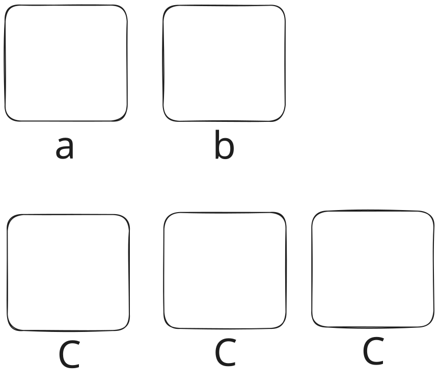
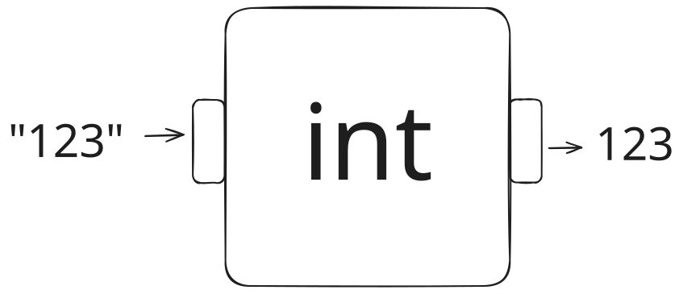

# 变量类型

## 学习目标

学完这一课，你应该能够：

1. 知道常见的数据类型：整数、小数、字符串。
2. 区分 `123` 和 `"123"`。
3. 使用 `int()` 把数字字符串转换成整数。
4. 理解为什么 `input()` 得到的内容通常需要转换类型。

## 为什么要学习类型

上一节课中，我们把变量比作“带名字的箱子”。

现在要进一步思考：箱子里放的东西也有不同种类。

生活中，我们会把物品分类：

- 香蕉、苹果、梨属于水果。
- 铅笔、橡皮、尺子属于文具。



Python 中的数据也需要分类。常见类型有：

- **整数 `int`**：没有小数点的数字，例如 `7`、`-25`、`100`。
- **浮点数 `float`**：带小数点的数字，例如 `3.14`、`-0.5`、`99.9`。
- **字符串 `str`**：文字，需要用引号包起来，例如 `"你好"`、`'Tom'`。

类型很重要，因为不同类型能做的事情不同。数字可以做加减乘除，字符串主要用来表示文字。

## 同一个变量可以放不同类型的数据

```python
a = 1
a = 1.1
a = 1.0
a = "hello world"
a = "my name is tom"
```

这段代码中，变量 `a` 的值一直在变化，类型也跟着变化。

!!! note
    Python 会根据你放进去的数据，判断它属于哪种类型。

## `"123"` 和 `123` 有什么区别

请看下面两行代码：

```python
print("123")
print(123)
```

屏幕上都会显示 `123`，但它们在 Python 眼里完全不同。

- `123` 是整数，可以参与数学计算。
- `"123"` 是字符串，本质是文字。

我们做一个实验：

```python
print(123 + 1)
print("123" + "1")
print("123" + 1)
```

结果是：

1. `123 + 1` 输出 `124`。
2. `"123" + "1"` 输出 `1231`，这里的 `+` 表示字符串拼接。
3. `"123" + 1` 会报错，因为字符串不能直接和整数相加。

所以请记住：

> 看起来像数字，不一定就是数字。只要加了引号，它就是字符串。

## 使用 `int()` 转换整数

如果有一个字符串 `"123"`，我们想让它参与数学计算，就需要先把它转换成整数。

错误写法：

```python
print("123" + 1)
```

正确写法：

```python
print(int("123") + 1)
```

输出：

```text
124
```

你可以把 `int()` 理解成一个转换工具：



它接收一个“内容是整数的字符串”，然后把它转换成真正的整数。

示例：

```python
a = "101"
b = int(a)
print(b)
```

```python
a = "543"
print(int(a) + int(a))
```

```python
a = "543"
b = "213"
c = a + b
d = int(c) + int(b)
print(d)
```

## 和 `input()` 的关系

`input()` 得到的内容默认是字符串。

所以如果你要输入数字并计算，通常要写成：

```python
age = int(input("请输入年龄："))
print(age + 1)
```

如果不写 `int()`，`age` 就是字符串，不能直接和数字相加。

## 本课小结

- `int` 表示整数。
- `float` 表示小数。
- `str` 表示字符串。
- `"123"` 是字符串，`123` 是整数。
- `int()` 可以把合适的字符串转换成整数。
- `input()` 得到的内容默认是字符串。

## 练习题

### 练习 1：判断类型

请判断下面的变量分别是哪种类型：`int`、`float` 还是 `str`？

```python
a = 5
b = "hello"
c = 9.8
d = "25"
```

### 练习 2：预测输出

请预测每一行 `print` 会输出什么。如果会报错，请写“报错”。

```python
print(10 + 20)
print("10" + "20")

a = "50"
b = 100
print(int(a) + b)

# print(a + b)
```

### 练习 3：字符串计算器

变量 `score_str = "85"` 表示考试分数。老师要给你加 10 分，请计算最终分数并打印。

```python
score_str = "85"
final_score = int(score_str) + 10
print(final_score)
```

### 练习 4：自我介绍

请完成下面任务：

1. 创建变量 `name` 存储你的名字。
2. 创建变量 `age_str` 存储你的年龄，例如 `"12"`。
3. 计算 5 年后的年龄。
4. 打印一句自我介绍。

??? 参考代码

    ```python
    name = "小明"
    age_str = "12"

    age_int = int(age_str)
    future_age = age_int + 5

    print(f"大家好，我叫{name}，5年后我将{future_age}岁。")
    ```
